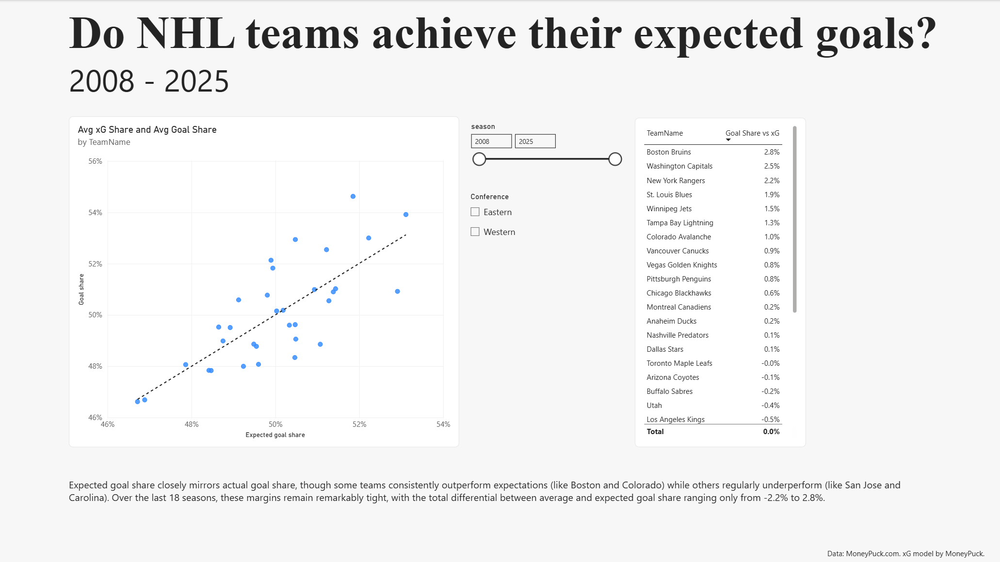
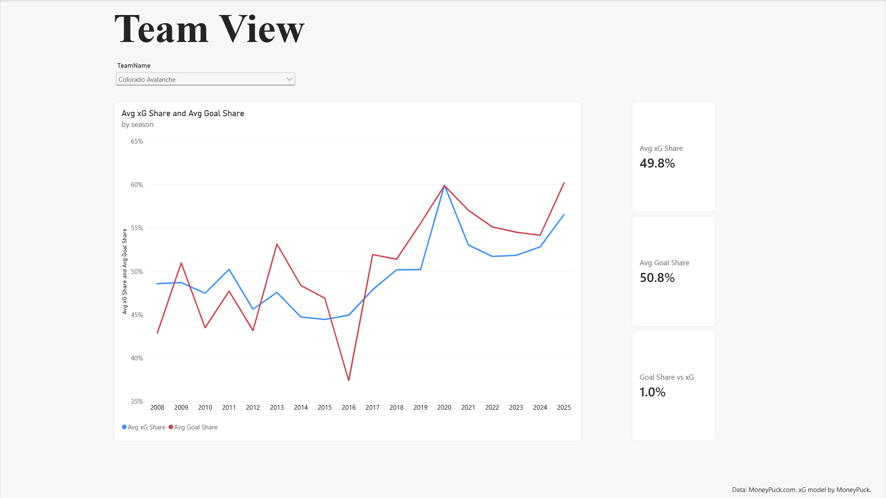

# NHL Expected Goals Dashboard

**Question:** Do NHL teams achieve their expected goals? How closely does a team's share of expected goals (xG) track its share of actual goals, and which teams beat or miss it across seasons?

**Tools:** Power BI (Power Query, DAX), Python (pandas, statsmodels)

## Dashboard

## Data
Team season files from MoneyPuck.com, regular season, 2008 to 2025 (554 team seasons). The xG model is MoneyPuck's. Data credit: MoneyPuck.com.

## Method
- Power BI: pulled the 18 season files with a Web connector query, filtered to the all situation, merged franchise codes, built a Teams table with a one to many relationship, and wrote DAX measures for average xG share, average goal share and the gap between them.
- Python (nhl_xg_analysis.ipynb): rebuilt the same dataset in pandas, counted exact seasons above and below xG for each team, and ran a regression of goal share on xG share across all team seasons.

## Findings
- Expected goals share tracks actual goal share roughly one for one. A 1 percentage point increase in xG share was associated with a 1.07 percentage point increase in goal share (slope = 1.0695), and xG share accounts for about 59% of the variation in single season goal share (r squared = .589).
- A few teams stand out. Boston scored more than its xG predicted in 14 of 18 seasons. San Jose fell short in 15 of 18.

## Limitations
- xG is MoneyPuck's model. A gap mixes finishing, goaltending, shot quality the model misses, and luck. This project cannot separate them.
- Franchise codes were merged (Atlanta into Winnipeg, plus older code styles). Utah is kept separate from Arizona.
- Conference labels reflect current alignment, so a few teams are off before 2013.
- Averages are unweighted across seasons. Vegas (9 seasons), Seattle (5) and Utah (2) have less history.
- The dashboard scatter plots 33 team averages, while the regression uses all 554 team seasons, so its R squared is lower.
- Small differences on the dashboard cards come from display rounding.

## Files
- nhl_xg_analysis.ipynb - Python notebook containing regression calculations for the data.  
- nhl_xg_analysis.pbix - Power BI dashboard with interactive visuals for the data

